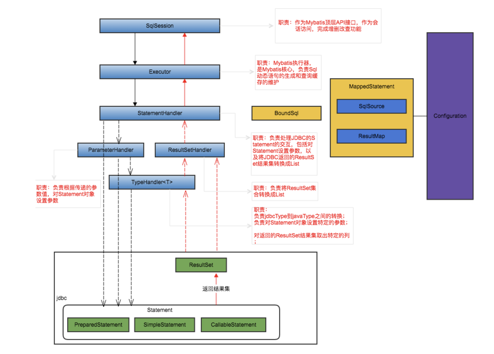

# mybatis架构

#### 接口层

接口层是MyBatis提供给开发人员的一套API.主要使用SqlSession接口.

#### 数据处理层

数据处理层是MyBatis框架内部的核心实现.来完成对映射文件的解析与数据处理: 

1. 参数解析与参数绑定
2. SQL解析
3. 结果集映射解析与结果集映射处理

#### 支撑层

支撑层用来完成MyBaits与数据库基本连接方式以及SQL命令与配置文件对应.主要负责:

1. MyBatis与数据库连接方式管理
2. MyBatis对事务管理方式 
3. 配置文件加载 
4. MyBatis查询缓存管理

# mybatis调用流程图

#### SqlSession

最顶层接口, 接收开发人员提供StatementId 和SQL参数.并返回操作结果

#### Executor

MyBatis执行器，是MyBatis 调度的核心，负责SQL语句的生成和查询缓存的维护

#### StatementHandler

封装了JDBC Statement操作，负责对JDBC statement 的操作，如设置参数、将 Statement结果集转换成List集合。

#### ParameterHandler

负责对用户传递的参数转换成JDBC Statement 所需要的参数

#### ResultSetHandler

负责将JDBC返回的ResultSet结果集对象转换成List类型的集合

#### TypeHandler

负责java数据类型和jdbc数据类型之间的映射和转换

#### MappedStatement

维护了一条<select|update|delete|insert>节点的封装

#### SqlSource

负责根据用户传递的parameterObject，动态地生成SQL语句，将信息封装到 BoundSql对象中，并返回BoundSql表示动态生成的SQL语句以及相应的参数信息

- DynamicSqlSource:主要是封装动态SQL标签解析之后的SQL语句和带有${}的 SQL语句
- RawSqlSource:主要封装带有#{}的SQL语句 
- StaticSqlSource:是BoundSql中要存储SQL语句的一个载体，上面两个SqlSource 的SQL语句，最终都会存储到该SqlSource实现类中。

#### Configuration

MyBatis所有的配置信息都维持在Configuration对象之中。

# 手写实现mybatis的思路

1. 编写自定义的配置文件和映射文件(可以参考mybatis xml定义及ognl的使用)

2. 使用Classloader加载全局配置文件，返回InputStream对象 

3. 配置文件加载

   - 全局配置文件加载，将XML信息存储到Configuration对象

     - 使用sax Reader去读取InputStream对象，创建Document对象 
     - 使用dom4j+xpath语法去解析Document对象 
     - 解析environments标签(封装DataSource对象，放入Configuration对象中)
     - 解析mappers标签

   - 映射文件加载，将XML信息封装到MappedStatement对象并放入Map集合 中，key为statement的id，value为MappedStatement对象

     - 使用Classloader加载全局配置文件，返回InputStream对象 

     - 使用sax Reader去读取InputStream对象，创建Document对象 

     - 使用dom4j+xpath语法去解析Document对象 

     - 解析根标签中的namespace属性和select等标签

       - 解析id属性

       - 解析parameterType属性，并处理成Class类型 
       - 解析resultType属性，并处理成Class类型 

       - 解析statementType属性(便于执行时，是选择Statement还是 preparedStatement)
       - 解析SQL语句(#{}和${})
         - 将#{}替换为占位符? 

           - 存储预编译SQL(已经将#{}替换为?的SQL语句) 

           - 创建`List<ParameterMapping>`集合，存储SQL参数信息 (属性名称、参数类型)
         - 将${}替换成真正的参数 
               - 使用OGNL表达式获取参数值 
           
           - 替换${}的内容

4. sqlsession执行 
   - 制定sqlsession接口和api方法 
   - 创建SqlSession
     - 创建Sqlsession需要先创建SqlSessionFactory，通过 SqlSessionFactoryBuilder使用构建者模式来创建，此时需要 Configuration对象去创建SqlSessionFactory
   - 执行sqlsession:参数有两个(statementId和参数对象)
     - 根据statementId，去Configuration中的MappedStatement集合中查找 对应的MappedStatement对象。
     - 取出MappedStatement中的SQL信息 
     - 取出MappedStatement中的statementType，用来创建Statement对象
       - 取出MappedStatement中的Configuration对象，通过 Configuration对象，获取DataSource对象，通过DataSource对 象，创建Connection，通过Connection创建Statement对象。 
       - 设置参数
         - 执行preparedStatement.setInt(1,value); 
           - 遍历`List<ParameterMapping>`集合(参数名称、属性类型、顺序)
             - 判断是否是集合类型、8种基本类型、String类型、 引用类型
               - 基本类型的话，传过来的参数就是SQL的参数值 
               - 引用类型的话，根据参数名称，获取引用类型对应的属性值
             - 调用setXXX方法赋值
       - 执行Statement (executeQuery方法，获取ResultSet结果集)
       - 处理结果集 (遍历结果集ResultSet)
         - 取出ResultSet中的所有列的名称和值和类型，存储到一个集合中 
         - 取出MappedStatement中的resultTypeClass，反射进行实例化。 
         - 遍历上面的集合，根据集合中的列的名称给属性赋值
